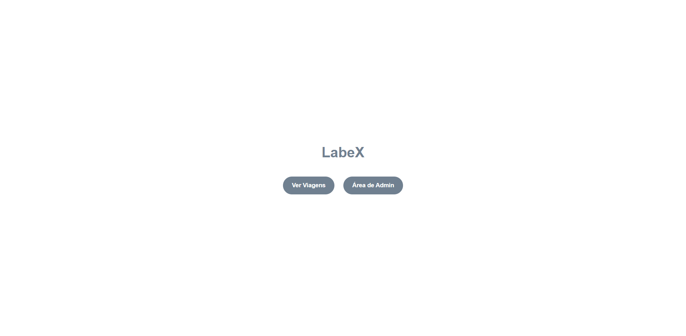

<h1 align="center">LabeX</h1>

<p align="center">
  <a href="#-tecnologias">Tecnologias</a>&nbsp;&nbsp;&nbsp;|&nbsp;&nbsp;&nbsp;
  <a href="#-projeto">Projeto</a>&nbsp;&nbsp;&nbsp;|&nbsp;&nbsp;&nbsp;
  <a href="#-como-executar">Como executar</a>&nbsp;&nbsp;&nbsp;
  

<p align="center"></p>


## 👨‍💻 Tecnologias

Projeto desenvolvido com as seguintes tecnologias:
<div style="display: inline-block"><br/>
    
    
    
    
</div>

## 💻 Projeto

LabeX, site criado para fins didáticos do curso Web Full Stack da Labenu.

## 🚀 Como executar

 Clonar o repositorio:
```bash
$ git clone https://github.com/Lets-DavIt/Lets-DavIt/edit/main/projetos/projeto-labex/
```
Acessar o repertório:
```bash
$ cd https://github.com/Lets-DavIt/Lets-DavIt/edit/main/projetos/projeto-labex/

```
****
## ✒️ Author

Davi Souza  [https://github.com/Lets-DavIt]
